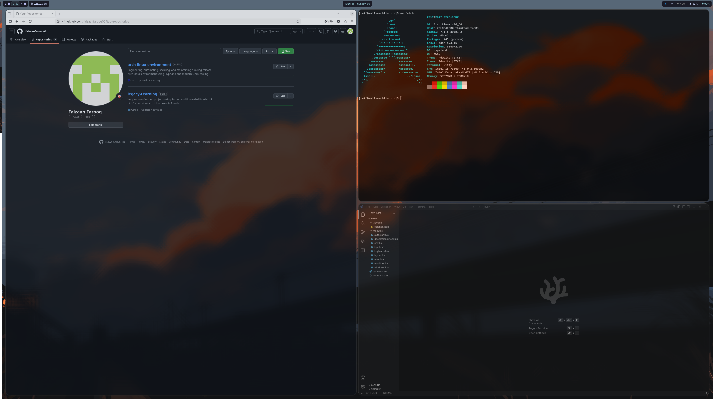

# Desktop Environment:

A custom Hyprland desktop environment engineered on Arch Linux to provide minimalist and efficient workspace for Linux, cloud and security engineering.

# Components

- Hyprland
- Waybar
- Hyprlock
- Kitty
- Awww
- Hyprshot

# Configuration

The desktop configuration is maintained through version-controlled dotfiles and symlinked into `~/.config`.

Current config includes:

- Modular Hyprland configuration
- Custom keyboard shortcuts
- GB keyboard layout
- Display management
- Desktop locking
- Custom Waybar
- Wallpaper management
